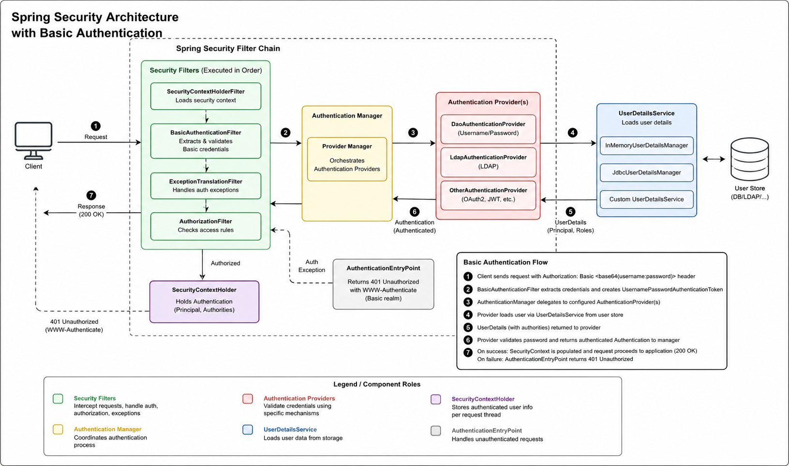

# What is Basic Authentication?

Basic Authentication is one of the simplest HTTP authentication methods. The client sends a username and password with every request in the Authorization header. The credentials are Base64 encoded (not encrypted), so Basic Authentication should always be used over HTTPS to protect them during transmission.

Example:

``
Authorization: Basic Base64(username:password)
``

### Spring Security Basic Authentication Flow (Step-by-Step)

The diagram illustrates how Spring Security authenticates a user using HTTP Basic Authentication. The process begins when a client sends a request and ends when the authenticated user is granted access to the requested resource.

1. The Request: The client sends an HTTP request with an Authorization: Basic <base64(username:password)> header.

2. The Filter: The BasicAuthenticationFilter intercepts the request, extracts the base64-encoded credentials, and decodes them into a cleartext username and password. It wraps these into a UsernamePasswordAuthenticationToken.

3. The Manager: The filter passes this token to the AuthenticationManager (usually implemented by ProviderManager), which orchestrates the validation process.

4. The Provider: The AuthenticationManager delegates the token to an AuthenticationProvider (like DaoAuthenticationProvider).

5. The User Details: The provider uses a UserDetailsService to look up the user's real credentials and roles from a database, memory, or external store.

6. Validation & Success: The provider matches the incoming password against the stored password (using a PasswordEncoder). If they match, an authenticated token is returned and stored in the SecurityContextHolder. The request then successfully proceeds to your controller.

7. Failure: If authentication fails, the AuthenticationEntryPoint takes over, halting the request and returning a 401 Unauthorized response with a WWW-Authenticate header.