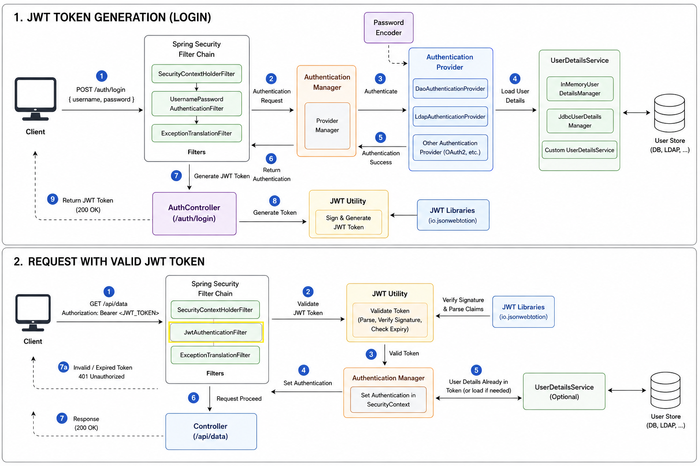

# What is JWT Authentication?

JWT (JSON Web Token) Authentication is a stateless authentication mechanism used to securely identify users in web applications and REST APIs. Unlike Basic Authentication, where the username and password are sent with every request, JWT authentication requires the user to log in only once. After successful authentication, the server generates a JWT token, which is returned to the client.

The client stores this token (typically in memory or secure storage) and includes it in the Authorization header of every subsequent request.

``
Authorization: Bearer <JWT_TOKEN>
``

A JWT consists of three parts:

- Header – Contains the token type and signing algorithm.
- Payload – Contains user information (claims), such as username, roles, and expiration time.
- Signature – Ensures the token has not been modified and verifies that it was issued by the trusted server.

Since the server validates the token instead of maintaining user sessions, JWT authentication is stateless, making it well suited for REST APIs and microservice architectures.

# JWT Authentication Flow
## Phase 1: JWT Token Generation (Login)
1. The client sends a login request containing the username and password.
2. The request passes through the Spring Security filter chain.
3. The AuthenticationManager delegates authentication to the appropriate AuthenticationProvider.
4. The UserDetailsService retrieves the user's information from the database or another user store.
5. The PasswordEncoder verifies the submitted password against the stored encoded password.
6. If authentication succeeds, the AuthenticationManager returns an authenticated user.
7. The authentication request reaches the AuthController.
8. The AuthController calls the JWT Utility to generate a signed JWT containing user information and an expiration time.
9. The generated JWT is returned to the client, which stores it for future requests.

## Phase 2: Request with a Valid JWT Token
1. The client sends a request to a protected endpoint with the JWT in the Authorization: Bearer <JWT_TOKEN> header.
2. The request passes through the Spring Security filter chain, where the JWT Authentication Filter extracts the token.
3. The JWT Utility validates the token by verifying its signature, parsing its claims, and checking whether it has expired.
4. If the token is valid, Spring Security creates an authenticated Authentication object and stores it in the SecurityContext.
5. The authenticated request proceeds to the controller, and the requested resource is returned with a successful response.
6. If the token is invalid, expired, or missing, Spring Security rejects the request and returns a 401 Unauthorized response.